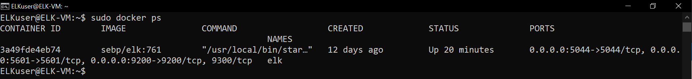

# Project-1
A project from my Cyber Security Boot Camp

## Automated ELK Stack Deployment

The files in this repository were used to configure the network depicted below.

These files have been tested and used to generate a live ELK deployment on Azure. They can be used to either recreate the entire deployment pictured above. Alternatively, select portions of the YAML files may be used to install only certain pieces of it, such as Filebeat.

This document contains the following details:
- Description of the Topology
- Access Policies
- ELK Configuration
  - Beats in Use
  - Machines Being Monitored
- How to Use the Ansible Build

### Description of the Topology

The main purpose of this network is to expose a load-balanced and monitored instance of DVWA, the D*mn Vulnerable Web Application.

Load balancing ensures that the application will be highly protected, in addition to restricting traffic to the network.

Integrating an ELK server allows users to easily monitor the vulnerable VMs for changes to the logs and system metrics.

The configuration details of each machine may be found below.

| Name     | Function | IP Address | Operating System |
|----------|----------|------------|------------------|
| Jump Box | Gateway  | 10.0.0.4   | Linux Ubuntu 18.04|
| Web-1    | Dvwa     | 10.0.0.5   | Linux Ubuntu 18.04|
| Web-2    | Dvwa     | 10.0.0.6   | Linux Ubuntu 18.04|
| ELK-VM   | Elk      | 10.1.0.4   | Linux Ubuntu 18.04|

### Access Policies

The machines on the internal network are not exposed to the public Internet. 

Only the Jump Box machine can accept connections from the Internet. Access to this machine is only allowed from the following IP addresses:
- 198.84.175.6

Machines within the network can only be accessed by the Jump Box machine.
- 13.90.99.145

A summary of the access policies in place can be found in the table below.

| Name     | Publicly Accessible | Allowed IP Addresses |
|----------|---------------------|----------------------|
| Jump Box | Yes                 | 198.84.175.6         |
| Web-1/2  | No                  | 13.90.99.145         |
| Elk-VM   | Yes                 | 198.84.175.6         |

### Elk Configuration

Ansible was used to automate configuration of the ELK machine. No configuration was performed manually, which is advantageous because it ensures that no part of the configuration was missed. Taking the time that the ensure that the playbook is perfect will help to automate running this playbook on multiple machines, if desired, efficent and errorlessly.

The playbook implements the following tasks:
- Installs Docker and Python3-pip to be used as the default docker module
- Increase virtual memory to a value of '262144'
- launch the elk image(sebp/elk:761) into the container
- Publish the list of port that Elk runs on (5601, 9200, 5044)
- Allowing the docker service to be enabled on boot 

The following screenshot displays the result of running `docker ps` after successfully configuring the ELK instance.

### Target Machines & Beats
This ELK server is configured to monitor the following machines:
- 10.0.0.5 and 10.0.0.6

We have installed the following Beats on these machines:
- Filebeat and Metricbeat

These Beats allow us to collect the following information from each machine:
- Filebeat collects the logs for each virtual machine, you should be able to see information like how many visitors you've had and where they are located. Along with seeing if any users experienced any errors like 404 or 503 and when they happend.
- Metricbeat provides metric logs for each virtual machine, you will be able to see information like CPU Usage and Memory Usage.

### Using the Playbook
In order to use the playbook, you will need to have an Ansible control node already configured. Assuming you have such a control node provisioned: 

SSH into the control node and follow the steps below:
- Copy the filebeat-playbook.yml and metricbeat-playbook.yml files to your ansible directory (~/etc/ansible).
- Update the hosts file to include your private IP addresses for the machines you want for each service. DVWA machines are under webservers while the Elk stack is under Elk. In turn you can then update each playbook file with the host to tell ansible which machines to run the playbook on.
- Run the playbooks, and navigate to the Public IP address of the Elk-VM on port 5601 to check that the installation worked as expected.

_As a **Bonus**, provide the specific commands the user will need to run to download the playbook, update the files, etc._
